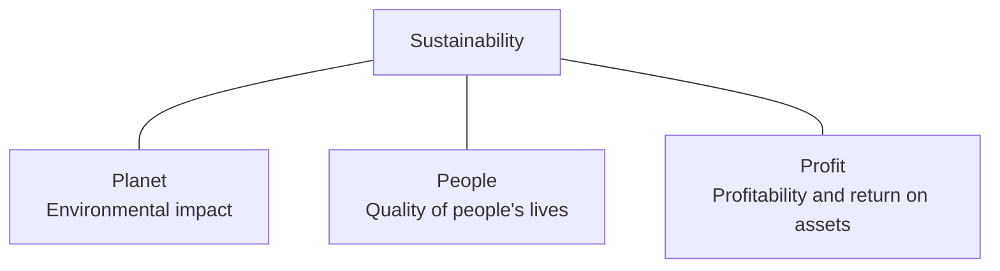

# IT2160 — Week 11
## Sustainability, Ethics, and Social Impact

**Institution:** Sri Lanka Institute of Information Technology (SLIIT)  
**Faculty:** Faculty of Computing  
**Module Code:** IT2160  
**Lecture/Week:** Week 11  
**Lecture Title:** Sustainability, Ethics, and Social Impact  
**Lecturer:** Sanjeeva Perera — Senior Academic Fellow, Department of Computer Systems Engineering, Faculty of Computing  
**Total PDF Pages/Slides:** 14

> “Sustainability means meeting the needs of the present without compromising the ability of future generations to meet their own needs.”

---

# Table of Contents

- [Page 01 — Title Page](#page-01--title-page)
- [Page 02 — Agenda](#page-02--agenda)
- [Page 03 — Impact of Sustainability: Triple Bottom Line](#page-03--impact-of-sustainability-triple-bottom-line)
- [Page 04 — Introduction: Why Sustainability, Ethics & Social Impact Matter](#page-04--introduction-why-sustainability-ethics--social-impact-matter)
- [Page 05 — Ethics as a Framework for Responsible IT Practice: Why Ethics is Central to Computing](#page-05--ethics-as-a-framework-for-responsible-it-practice-why-ethics-is-central-to-computing)
- [Page 06 — Ethics as a Framework for Responsible IT Practice: Sri Lankan & Global Context](#page-06--ethics-as-a-framework-for-responsible-it-practice-sri-lankan--global-context)
- [Page 07 — Sustainability in IT: Global + Sri Lanka](#page-07--sustainability-in-it-global--sri-lanka)
- [Page 08 — Sustainability in IT: Sri Lankan Issues and Solutions](#page-08--sustainability-in-it-sri-lankan-issues-and-solutions)
- [Page 09 — Professional Responsibilities](#page-09--professional-responsibilities)
- [Page 10 — Responsibilities Summary](#page-10--responsibilities-summary)
- [Page 11 — Responsibilities Summary Repeated](#page-11--responsibilities-summary-repeated)
- [Page 12 — IT Laws and Sri Lanka’s PDPA](#page-12--it-laws-and-sri-lankas-pdpa)
- [Page 13 — Corporate Accountability](#page-13--corporate-accountability)
- [Page 14 — Questions](#page-14--questions)
- [Key Definitions](#key-definitions)
- [Important Visuals and Drawn Diagrams](#important-visuals-and-drawn-diagrams)
- [Likely Exam Questions and Short Answers](#likely-exam-questions-and-short-answers)
- [Common Mistakes to Avoid](#common-mistakes-to-avoid)
- [Final One-Page Revision Notes](#final-one-page-revision-notes)

---

# Page-by-Page Lecture Notes

## Page 01 — Title Page

### Original Slide Content

- **Week 11 — Sustainability, Ethics, and Social Impact**
- “Sustainability means meeting the needs of the present without compromising the ability of future generations to meet their own needs.”
- **Sanjeeva Perera** — Senior Academic Fellow
- Department of Computer Systems Engineering
- Faculty of Computing

### Visual Explanation

The slide is a title slide. It introduces the main theme: IT decisions must not only be technically correct, but also sustainable, ethical, and socially responsible.

### Explanation

This lecture focuses on how computing affects people, organizations, society, and the environment. It is not enough for software to “work.” A system can technically work but still be harmful if it violates privacy, increases bias, wastes energy, damages society, or ignores legal responsibilities.

### Visual/Text Diagram

```text
Responsible IT Practice
        |
        |-- Sustainability  -> protect future resources
        |-- Ethics          -> choose right action, avoid harm
        |-- Social Impact   -> consider effects on people and society
```

### Exam Tip

Remember the core sustainability definition. It is useful for short-answer questions asking “What is sustainability?” or “Why is sustainability important in IT?”

### Common Mistake

Do not define sustainability only as “environment protection.” In this lecture, sustainability also connects with people, society, ethics, and long-term responsibility.

---

## Page 02 — Agenda

### Original Slide Content

The lecture covers:

1. Introduction — Why Sustainability, Ethics & Social Impact Matter
2. Ethics as a Framework for Responsible IT Practice
3. Sustainability in IT
4. Professional Responsibilities — Clients, Employers, Colleagues, Society
5. IT Regulation & Legal Frameworks — Global & Sri Lanka
6. Corporate Accountability & Social Impact

### Visual Explanation

The slide uses an agenda list. It gives the logical flow of the lecture: first the importance of ethics and sustainability, then practical responsibilities, laws, and corporate accountability.

### Explanation

The lecture is structured from broad ideas to practical application:

| Lecture Area | Main Question Answered |
|---|---|
| Introduction | Why should IT professionals care about ethics and sustainability? |
| Ethics | How do we decide what is responsible or harmful? |
| Sustainability in IT | How does technology affect the environment? |
| Professional responsibilities | What duties do IT professionals have? |
| IT laws | What legal rules affect IT practice? |
| Corporate accountability | How should organizations answer for their impact? |

### Visual/Text Diagram

```text
Why it matters
      ↓
Ethical framework
      ↓
Sustainability in IT
      ↓
Professional responsibilities
      ↓
Legal frameworks
      ↓
Corporate accountability
```

### Exam Tip

Agenda slides help predict essay structure. A good essay answer can follow this order: importance → ethical principles → sustainability issues → responsibilities → law → accountability.

### Common Mistake

Do not treat these topics as separate memorization points. They are connected: ethics guides decisions, sustainability is one major ethical concern, law sets minimum rules, and accountability checks organizations.

---

## Page 03 — Impact of Sustainability: Triple Bottom Line

### Original Slide Content

**Impact of Sustainability — Triple Bottom Line**

- **Planet** — The environmental account, measured by environmental impact of the operation.
- **People** — The social account, measured by the impact of the operation on the quality of people’s lives.
- **Profit** — The economic account, measured by profitability, return on assets, etc. of the operation.
- Center concept: **Sustainability**

### Visual Explanation

The slide shows the **Triple Bottom Line** model. Sustainability is placed at the center, connected to three dimensions:

1. **Planet** — environmental responsibility
2. **People** — social responsibility
3. **Profit** — economic responsibility

This means a sustainable organization should not only chase profit. It must also reduce environmental harm and improve or protect people’s lives.

### Drawn Visual Diagram — Triple Bottom Line

```text
                         PLANET
        Environmental impact of operations
                            ▲
                            |
                            |
 PEOPLE  ---------------- SUSTAINABILITY ---------------- PROFIT
 Social impact on                                      Economic account:
 quality of life                                      profitability, ROA, etc.
```

### Mermaid Diagram Version



### Explanation

The Triple Bottom Line is a way of evaluating sustainability using three accounts instead of only financial profit.

| Dimension | Meaning | IT Example |
|---|---|---|
| Planet | Environmental effect | Reducing data center electricity use, reducing e-waste |
| People | Social effect | Protecting privacy, accessibility, fair treatment of users |
| Profit | Economic effect | Building systems that are financially viable and efficient |

### Exam Tip

If asked “Explain Triple Bottom Line,” write: **Planet + People + Profit** and give one IT example for each.

### Common Mistake

Do not say Triple Bottom Line is only about business profit. Profit is only one part; sustainability requires balancing all three.

---

## Page 04 — Introduction: Why Sustainability, Ethics & Social Impact Matter

### Original Slide Content

Technology influences society, culture, the environment, and human behavior.

According to Baase (*A Gift of Fire*), computing creates both opportunities and risks because digital systems amplify human decisions at massive scale.

Unerman et al. (*Belonging*) emphasize that ethical technology requires inclusive cultures, fairness, and respect for all stakeholders.

**Key Themes**

- Technology disrupts privacy, security, work, democratic systems.
- Ethical reflection is essential because consequences are hard to predict.
- Social impacts, such as misinformation, automation, and surveillance, must be evaluated.
- Fairness, inclusion, and belonging are moral responsibilities in organizations.
- Ethical behavior emerges from culture, not only rules.
- Decisions in IT should consider underrepresented voices and social equity.

### Visual Explanation

The slide is mainly textual. It connects technology with society, culture, environment, and human behavior. The key message is that IT decisions scale quickly and can cause broad effects.

### Explanation

Computing systems can affect millions of users. A small design decision can become a large social problem when deployed at scale. For example, a recommendation algorithm can spread misinformation, a hiring algorithm can discriminate, and poor privacy design can expose personal data.

The slide also stresses that ethical behavior depends on organizational culture. Rules are useful, but rules alone are not enough. Teams must create a culture where people can question harmful decisions, report problems, and consider marginalized users.

### Visual/Text Diagram

```text
IT Decision
    ↓
Software / Digital System
    ↓
Large-scale use
    ↓
Possible impacts:
  - Privacy loss
  - Security risks
  - Job disruption
  - Misinformation
  - Surveillance
  - Inequality
```

### Key Themes Table

| Theme | Meaning | Example |
|---|---|---|
| Privacy disruption | Technology collects and exposes personal data | App tracking user location |
| Security disruption | Weak systems create risk | Data breach |
| Work disruption | Automation changes jobs | AI replacing repetitive tasks |
| Democratic disruption | Platforms influence public opinion | Misinformation campaigns |
| Inclusion | Systems must consider all users | Accessible design for disabled users |
| Social equity | Underrepresented groups must not be ignored | Fair AI model testing |

### Exam Tip

For essay questions, use this structure: **Technology scales human decisions → consequences can be hard to predict → ethical reflection is needed → inclusion and fairness must be considered.**

### Common Mistake

Do not write only “technology is good.” The lecture expects a balanced answer: technology creates both opportunities and risks.

---

## Page 05 — Ethics as a Framework for Responsible IT Practice: Why Ethics is Central to Computing

### Original Slide Content

**1. Why Ethics is Central to Computing**

- Computing power enables actions such as tracking, profiling, and manipulation that were never before possible.
- Ethical dilemmas involve balancing benefits vs risks.
- Developers must anticipate unintended consequences.
- Case examples: AI surveillance, biometric tracking, online anonymity, cyberbullying.
- Ethical workplaces require respect, fairness, inclusion, and psychological safety.
- Biased systems arise from biased cultures.
- IT systems must avoid reinforcing inequality or discrimination.

### Visual Explanation

The slide is a concept list. It shows why ethics is not optional in computing. Computing can create powerful systems that affect users directly and indirectly.

### Explanation

Ethics gives IT professionals a framework to decide what should and should not be done. Some systems may be profitable or technically possible but still harmful. For example, an AI surveillance tool may improve monitoring but can damage privacy and freedom if misused.

The slide also connects technical bias with workplace culture. If a development team ignores diversity and fairness, the software they build may also ignore those values.

### Visual/Text Diagram — Ethical Decision Flow

```text
New Technology Idea
        ↓
Check Benefits
        ↓
Check Risks
        ↓
Identify affected stakeholders
        ↓
Check privacy, fairness, safety, inclusion
        ↓
Modify, reject, or approve responsibly
```

### Benefits vs Risks Table

| Technology Example | Possible Benefit | Possible Risk |
|---|---|---|
| AI surveillance | Improved security | Privacy invasion, abuse of power |
| Biometric tracking | Easier authentication | Permanent identity data exposure |
| Online anonymity | Free expression | Cyberbullying and illegal behavior |
| Profiling | Personalized services | Manipulation and discrimination |

### Exam Tip

If asked “Why is ethics central to computing?”, mention **tracking, profiling, manipulation, unintended consequences, bias, inequality, and responsibility to avoid harm**.

### Common Mistake

Do not say ethics is only about following the law. Ethical responsibility is broader than legal compliance.

---

## Page 06 — Ethics as a Framework for Responsible IT Practice: Sri Lankan & Global Context

### Original Slide Content

**2. Sri Lankan & Global Context**

- **Sri Lanka:** data leaks, national digital ID concerns, AI use in banking/HR.
- **Global:** social media addiction, data exploitation, environmental damage from e-waste.

### Visual Explanation

The slide compares local and global ethical IT issues. It shows that ethical computing is not only a foreign or theoretical topic; Sri Lanka also faces real IT ethics challenges.

### Explanation

In Sri Lanka, digital transformation creates benefits but also risks. Data leaks can expose citizens’ personal information. National digital ID systems can improve services but raise surveillance and privacy concerns. AI use in banking or HR can improve efficiency but may create discrimination if models are biased.

Globally, social media addiction, personal data exploitation, and e-waste show how technology affects mental health, privacy, and the environment.

### Comparison Table

| Context | Issue | Ethical Concern |
|---|---|---|
| Sri Lanka | Data leaks | Privacy and confidentiality |
| Sri Lanka | National digital ID | Surveillance, consent, data protection |
| Sri Lanka | AI in banking/HR | Bias, discrimination, transparency |
| Global | Social media addiction | Mental health and manipulation |
| Global | Data exploitation | Lack of consent and unfair profit from user data |
| Global | E-waste | Environmental damage and unsafe disposal |

### Visual/Text Diagram

```text
Ethical IT Issues
├── Sri Lankan Context
│   ├── Data leaks
│   ├── Digital ID concerns
│   └── AI in banking / HR
└── Global Context
    ├── Social media addiction
    ├── Data exploitation
    └── E-waste damage
```

### Exam Tip

Use both Sri Lankan and global examples in answers. That gives stronger marks than writing only generic theory.

### Common Mistake

Do not treat “AI in banking/HR” as automatically good. The ethical issue is whether the AI is fair, transparent, secure, and accountable.

---

## Page 07 — Sustainability in IT: Global + Sri Lanka

### Original Slide Content

**1. Sustainability & Environmental Impact**

Highlights how:

- Rapid hardware obsolescence increases global e-waste.
- Manufacturing electronics uses hazardous materials.
- Data centers require massive electricity, contributing to carbon emissions.

**2. Global Sustainability Issues**

- Big Tech running hyperscale data centers such as AWS and Google → high energy demand.
- Software inefficiency increases energy consumption.
- Cryptocurrency mining → extreme carbon footprint.
- Fast upgrade culture, such as phones every 1–2 years → waste.

### Visual Explanation

The slide lists environmental problems caused or increased by IT. It focuses on hardware waste, hazardous manufacturing, energy-heavy data centers, inefficient software, cryptocurrency mining, and frequent device replacement.

### Explanation

Sustainability in IT is about reducing the environmental cost of digital systems. Even software has environmental impact because inefficient software requires more processing, more servers, more cooling, and more electricity.

Hardware also has a physical lifecycle: mining raw materials, manufacturing devices, shipping them, using electricity, and disposing of them as e-waste.

### Drawn Visual Diagram — IT Environmental Impact Chain

```text
Device / Software Demand
        ↓
Hardware Manufacturing
        ↓
Hazardous Materials + Resource Use
        ↓
Data Centers + Electricity Use
        ↓
Carbon Emissions
        ↓
Frequent Upgrades
        ↓
E-waste
```

### Global Issues Table

| Sustainability Issue | Cause | Impact |
|---|---|---|
| E-waste | Rapid hardware obsolescence | More discarded electronic devices |
| Hazardous materials | Electronics manufacturing | Pollution and health risk |
| Data center emissions | Massive electricity demand | Carbon footprint |
| Software inefficiency | Poorly optimized code | More CPU, memory, battery, and server usage |
| Cryptocurrency mining | High computation demand | Extreme energy consumption |
| Fast upgrade culture | Replacing phones every 1–2 years | Increased waste |

### Exam Tip

Strong answer phrase: **“Software inefficiency is also a sustainability issue because inefficient systems increase energy consumption.”**

### Common Mistake

Do not think sustainability is only about hardware recycling. The lecture also includes software efficiency and data center energy usage.

---

## Page 08 — Sustainability in IT: Sri Lankan Issues and Solutions

### Original Slide Content

**3. Sri Lankan Sustainability Issues**

- Rising e-waste without robust recycling infrastructure.
- Corporations adopting cloud services, increasing energy demand.
- Government push for digital transformation → increased device usage.

**4. Solution**

- Green computing: energy-efficient software/hardware.
- Circular economy: repairing, refurbishing, recycling.
- Align with UN SDGs: climate action, responsible consumption.
- Encourage repair culture over frequent upgrades.

### Visual Explanation

The slide moves from problems to solutions. It highlights Sri Lankan sustainability issues and gives practical mitigation strategies.

### Explanation

Sri Lanka faces sustainability pressure because more people, companies, and government services are becoming digital. This increases the number of devices, servers, and cloud services used. Without proper recycling infrastructure, old devices become e-waste.

The solutions focus on reducing waste and improving efficiency. Green computing reduces energy use. A circular economy keeps products useful for longer through repair, reuse, refurbishing, and recycling.

### Drawn Visual Diagram — Problem to Solution

```text
Sri Lankan IT Growth
        ↓
More devices + more cloud services
        ↓
Higher energy demand + more e-waste
        ↓
Solutions:
  1. Green computing
  2. Repair culture
  3. Refurbishing
  4. Recycling
  5. UN SDG alignment
```

### Solution Mapping Table

| Problem | Better Solution | Why It Helps |
|---|---|---|
| Rising e-waste | Recycling and refurbishing | Reduces discarded electronics |
| Weak recycling infrastructure | Circular economy practices | Extends device life |
| Cloud energy demand | Energy-efficient software and cloud choices | Reduces carbon footprint |
| Frequent upgrades | Repair culture | Prevents unnecessary waste |
| Digital transformation growth | Sustainability planning | Prevents uncontrolled environmental cost |

### Exam Tip

For “Discuss solutions,” do not write only “recycle.” Include **green computing, circular economy, repair culture, and UN SDGs**.

### Common Mistake

Do not say cloud computing has no environmental impact. Cloud services still run on physical data centers that use electricity.

---

## Page 09 — Professional Responsibilities

### Original Slide Content

Ethical IT professionals must:

- Avoid harm.
- Be honest and transparent.
- Respect privacy and confidentiality.
- Prioritize public welfare when designing systems.
- Promote fairness, diversity, and belonging.
- Prevent discrimination and harmful bias.
- Encourage psychological safety and accountability.

### Visual Explanation

The slide gives a responsibility checklist for IT professionals. It covers user safety, honesty, privacy, public welfare, fairness, bias prevention, and workplace culture.

### Explanation

Professional responsibility means an IT professional must consider the consequences of their work. The duty is not only to finish tasks or satisfy a manager. IT professionals must protect users, respect data, avoid harm, and speak up when systems are unsafe or unfair.

### Professional Responsibility Checklist

| Responsibility | Meaning | Practical IT Behavior |
|---|---|---|
| Avoid harm | Prevent damage to users or society | Do security testing before release |
| Honesty | Communicate truthfully | Do not hide known system risks |
| Privacy | Protect personal data | Collect only needed data |
| Public welfare | Prioritize society’s safety | Reject dangerous misuse of software |
| Fairness | Treat users equally | Test systems for bias |
| Diversity and belonging | Include different users and team voices | Accessible and inclusive design |
| Psychological safety | Allow people to speak up | Encourage reporting of ethical concerns |
| Accountability | Answer for decisions | Keep records, audits, and review processes |

### Visual/Text Diagram

```text
Ethical IT Professional
├── User safety
├── Privacy and confidentiality
├── Honesty and transparency
├── Public welfare
├── Fairness and inclusion
├── Bias prevention
└── Accountability
```

### Exam Tip

For professional responsibility questions, write responsibilities as action verbs: **avoid, respect, prioritize, promote, prevent, encourage**.

### Common Mistake

Do not focus only on responsibility to the employer. The lecture clearly includes clients, employers, colleagues, and society.

---

## Page 10 — Responsibilities Summary

### Original Slide Content

**Responsibilities Summary**

- **Clients** — Build safe, inclusive, reliable systems.
- **Employers** — Follow policies, report risks, uphold ethics.
- **Colleagues** — Support inclusive teamwork and equal opportunities.
- **Society** — Ensure tech contributes to social good, sustainability, and fairness.

### Visual Explanation

The slide summarizes responsibilities by stakeholder group. Each group has a different expectation from the IT professional.

### Explanation

Stakeholders are people or groups affected by IT work. A responsible IT professional must balance duties to all stakeholders. For example, an employer may want quick delivery, but society and users need safe and fair systems.

### Drawn Stakeholder Responsibility Diagram

```text
                         IT Professional
                               |
        -------------------------------------------------
        |                |                |              |
     Clients         Employers       Colleagues       Society
        |                |                |              |
 Safe, reliable   Follow policy,   Inclusive       Social good,
 inclusive        report risks     teamwork        fairness,
 systems                                           sustainability
```

### Responsibilities Table

| Stakeholder | Responsibility | Example |
|---|---|---|
| Clients | Build safe, inclusive, reliable systems | Secure web app with accessibility support |
| Employers | Follow policies, report risks, uphold ethics | Report a security vulnerability honestly |
| Colleagues | Support inclusive teamwork and equal opportunities | Respect different views and avoid discrimination |
| Society | Ensure technology supports social good, sustainability, and fairness | Avoid building systems that harm public welfare |

### Exam Tip

This slide can come as a “Discuss professional responsibilities of IT professionals” question. Structure the answer by stakeholder: **clients, employers, colleagues, society**.

### Common Mistake

Do not write only “follow company rules.” Professional responsibility can require challenging harmful company decisions.

---

## Page 11 — Responsibilities Summary Repeated

### Original Slide Content

**Responsibilities Summary**

- **Clients** — Build safe, inclusive, reliable systems.
- **Employers** — Follow policies, report risks, uphold ethics.
- **Colleagues** — Support inclusive teamwork and equal opportunities.
- **Society** — Ensure tech contributes to social good, sustainability, and fairness.

### Visual Explanation

This slide repeats the previous stakeholder responsibility summary. The repetition suggests the concept is important for revision and exams.

### Explanation

The repeated slide reinforces that ethical IT responsibility is multi-directional. You are responsible not only to the person paying you, but also to users, colleagues, and wider society.

### Visual/Text Diagram — Responsibility Balance

```text
Responsible IT decision = balance of duties

Client needs      + Employer policies
Colleague respect + Society/public welfare
Privacy           + Fairness
Safety            + Sustainability
```

### Exam Tip

If a question asks for “stakeholders in ethical IT practice,” use these four categories: **clients, employers, colleagues, society**.

### Common Mistake

Do not ignore society. Society is often the highest-level stakeholder in ethical computing because technology can affect people beyond direct users.

---

## Page 12 — IT Laws and Sri Lanka’s PDPA

### Original Slide Content

**GDPR — Key Ideas**

- Companies must be transparent.
- Users have strong rights over their data.
- Heavy fines encourage compliance.

**Sri Lanka’s PDPA**

- Consent required for data collection.
- Users can request deletion or correction.
- Organizations must safeguard all personal data.
- Violations lead to penalties.

**Other Sri Lankan Acts**

- Computer Crimes Act → illegal access, hacking.
- Electronic Transactions Act → digital signatures.
- RTI Act → transparency in government.

### Visual Explanation

The slide presents legal frameworks as grouped lists. It compares global privacy law ideas with Sri Lankan legal responsibilities.

### Explanation

Legal frameworks set minimum standards for responsible IT practice. Ethics asks “what is right?” Law asks “what is required?” An IT professional should satisfy both.

The GDPR gives strong data rights and requires transparency. Sri Lanka’s PDPA focuses on consent, deletion/correction rights, safeguarding personal data, and penalties for violations.

### Drawn Legal Framework Map

```text
IT Legal Responsibility
├── GDPR
│   ├── Transparency
│   ├── Strong user data rights
│   └── Heavy fines
├── Sri Lanka PDPA
│   ├── Consent for data collection
│   ├── Deletion / correction requests
│   ├── Safeguard personal data
│   └── Penalties for violations
└── Other Sri Lankan Acts
    ├── Computer Crimes Act -> illegal access / hacking
    ├── Electronic Transactions Act -> digital signatures
    └── RTI Act -> government transparency
```

### Comparison Table

| Legal Framework | Main Focus | IT Professional Must Remember |
|---|---|---|
| GDPR | User data rights and transparency | Inform users and respect data rights |
| Sri Lanka PDPA | Consent, correction/deletion, data protection | Collect data lawfully and safeguard it |
| Computer Crimes Act | Illegal access and hacking | Do not access systems without permission |
| Electronic Transactions Act | Digital signatures and electronic transactions | Supports legal validity of digital transactions |
| RTI Act | Transparency in government | Supports public access to information |

### Exam Tip

For Sri Lankan legal questions, mention **PDPA, Computer Crimes Act, Electronic Transactions Act, and RTI Act**. For privacy questions, compare **GDPR and PDPA**.

### Common Mistake

Do not say consent alone is enough. Organizations must also safeguard data and allow deletion/correction where applicable.

---

## Page 13 — Corporate Accountability

### Original Slide Content

**What accountability means:**

- Companies must answer for environmental, ethical, and social impact.
- They must prevent harm, not just fix it afterwards.

**Examples:**

- Google: carbon-neutral data centers.
- Microsoft: accessibility-focused AI.
- Sri Lankan companies adopting green IT systems.

**Tools:**

- Audits.
- Sustainability reports.
- Third-party reviews.
- Whistleblower protection.

### Visual Explanation

The slide explains corporate accountability using definition, examples, and tools. It shows that accountability requires prevention, reporting, review, and protection for people who report wrongdoing.

### Explanation

Corporate accountability means companies cannot simply claim that technology is neutral. If their systems cause environmental harm, discrimination, privacy damage, or social harm, they must answer for it.

Accountability is stronger when organizations use audits, publish sustainability reports, allow independent third-party reviews, and protect whistleblowers.

### Drawn Corporate Accountability Flow

```text
Company builds / uses technology
              ↓
Environmental, ethical, and social impact occurs
              ↓
Company must answer for impact
              ↓
Accountability tools:
  - Audits
  - Sustainability reports
  - Third-party reviews
  - Whistleblower protection
              ↓
Goal: prevent harm before it happens
```

### Accountability Tools Table

| Tool | Purpose | Example Use |
|---|---|---|
| Audit | Check whether systems follow standards | Data privacy audit |
| Sustainability report | Publicly report environmental and social impact | Annual carbon footprint report |
| Third-party review | Independent external evaluation | External AI fairness review |
| Whistleblower protection | Protect people who report wrongdoing | Employee reports unsafe data use |

### Exam Tip

Use the phrase: **“Corporate accountability means preventing harm, not only fixing harm afterwards.”**

### Common Mistake

Do not treat accountability as public relations only. It must include real review mechanisms and prevention of harm.

---

## Page 14 — Questions

### Original Slide Content

- Questions?
- Week 11 — Sustainability, Ethics, and Social Impact

### Visual Explanation

The slide is a closing slide inviting questions. It marks the end of the lecture.

### Explanation

This page signals that the core lecture content is complete. Use it as a reminder to revise the main topics: sustainability, ethics, social impact, professional duties, laws, and corporate accountability.

### Visual/Text Diagram — Full Lecture Flow

```text
Sustainability definition
        ↓
Triple Bottom Line
        ↓
Ethical IT practice
        ↓
Sri Lankan + global issues
        ↓
Sustainability in IT
        ↓
Professional responsibilities
        ↓
IT laws and PDPA
        ↓
Corporate accountability
```

### Exam Tip

Before the exam, revise this lecture as an essay topic. It is likely to appear as a discussion question rather than a coding question.

### Common Mistake

No major common mistake.

---

# Key Definitions

## Sustainability

### Definition
Sustainability means meeting present needs without compromising the ability of future generations to meet their own needs.

### Simple Meaning
Use technology and resources responsibly so future people are not harmed.

### Example
Designing software that uses less server energy and supporting device repair instead of frequent replacement.

## Triple Bottom Line

### Definition
A sustainability model that measures performance using three accounts: people, planet, and profit.

### Simple Meaning
A system or business should be socially good, environmentally responsible, and economically viable.

### Example
A company reduces data center emissions, treats users fairly, and remains profitable.

## Ethics in Computing

### Definition
Ethics in computing is the practice of making responsible decisions about how technology affects users, society, privacy, fairness, and harm.

### Simple Meaning
Do not build harmful systems just because they are technically possible.

### Example
Rejecting an AI model that discriminates against applicants in hiring.

## Social Impact

### Definition
Social impact is the effect that technology has on people, communities, culture, democracy, work, and quality of life.

### Simple Meaning
Technology changes society; we must check whether the change is good or harmful.

### Example
Social media can connect people, but it can also spread misinformation.

## Green Computing

### Definition
Green computing is the design and use of computing systems in an energy-efficient and environmentally responsible way.

### Simple Meaning
Build and use IT systems with less power, less waste, and longer hardware life.

### Example
Optimizing software to reduce server load and battery usage.

## Circular Economy

### Definition
A circular economy keeps resources in use for as long as possible through repair, reuse, refurbishing, and recycling.

### Simple Meaning
Do not throw devices away quickly; repair and reuse them.

### Example
Refurbishing laptops instead of buying new ones every year.

## PDPA

### Definition
Sri Lanka’s Personal Data Protection Act focuses on lawful personal data processing, consent, correction/deletion rights, safeguarding personal data, and penalties for violations.

### Simple Meaning
Organizations must handle people’s personal data carefully and legally.

### Example
A company must get valid consent before collecting customer data and must protect that data.

---

# Important Visuals and Drawn Diagrams

| Page | Visual/Diagram | Markdown Recreation Included | Meaning |
|---|---|---|---|
| 03 | Triple Bottom Line | ASCII + Mermaid diagram | Sustainability balances people, planet, and profit |
| 04 | IT impact chain | ASCII flow | IT decisions scale into social consequences |
| 05 | Ethical decision flow | ASCII flow | Benefits and risks must be checked before implementation |
| 06 | Sri Lankan vs global context | Tree diagram | Ethical IT issues exist locally and globally |
| 07 | IT environmental impact chain | ASCII flow | Hardware, data centers, software, and e-waste affect environment |
| 08 | Sri Lankan problem-to-solution flow | ASCII flow | Green computing and circular economy reduce harm |
| 10 | Stakeholder responsibility diagram | ASCII diagram | Duties differ for clients, employers, colleagues, and society |
| 12 | IT legal framework map | Tree diagram | GDPR, PDPA, and Sri Lankan Acts guide compliance |
| 13 | Corporate accountability flow | ASCII flow | Companies must prevent and answer for harm |

---

# Full Lecture Summary

This lecture explains how IT professionals must think beyond technical success. Technology affects society, privacy, security, work, democratic systems, human behavior, and the environment. Because digital systems operate at massive scale, small design decisions can create large consequences.

The lecture introduces sustainability through the Triple Bottom Line: **People, Planet, and Profit**. Sustainable IT must protect quality of life, reduce environmental damage, and remain economically viable.

Ethics is presented as a framework for responsible IT practice. Developers must balance benefits and risks, anticipate unintended consequences, avoid bias, protect privacy, and create inclusive systems. Ethical workplaces need fairness, respect, inclusion, psychological safety, and accountability.

The lecture also discusses local and global issues. Sri Lanka faces challenges such as data leaks, national digital ID concerns, AI in banking and HR, e-waste, cloud service energy demand, and growing device usage. Globally, issues include social media addiction, data exploitation, cryptocurrency mining, software inefficiency, and environmental damage from e-waste.

Professional responsibilities are grouped by stakeholder: clients, employers, colleagues, and society. IT professionals must build safe and reliable systems, follow policies, report risks, support inclusive teamwork, and ensure technology contributes to social good, fairness, and sustainability.

Legal frameworks include GDPR, Sri Lanka’s PDPA, Computer Crimes Act, Electronic Transactions Act, and RTI Act. These laws set minimum standards for privacy, security, digital transactions, illegal access, and transparency.

Finally, corporate accountability means companies must answer for environmental, ethical, and social impacts. They must prevent harm, not only fix it afterwards. Tools include audits, sustainability reports, third-party reviews, and whistleblower protection.

---

# Key Definitions Table

| Term | Meaning | Example |
|---|---|---|
| Sustainability | Meeting present needs without harming future generations | Energy-efficient software |
| Triple Bottom Line | Sustainability measured by People, Planet, Profit | Balance social, environmental, economic goals |
| People | Social account: quality of people’s lives | Inclusive software design |
| Planet | Environmental account: impact on environment | Reducing e-waste |
| Profit | Economic account: profitability and returns | Sustainable business model |
| Ethics | Framework for responsible decision-making | Avoiding AI bias |
| Social Impact | Effects of technology on people and society | Misinformation, automation, surveillance |
| Green Computing | Environmentally responsible computing | Low-energy hardware/software |
| Circular Economy | Repair, refurbish, reuse, recycle | Refurbished laptops |
| PDPA | Sri Lankan personal data protection law | Consent and deletion rights |
| GDPR | EU privacy and data protection regulation | Transparency and user data rights |
| Corporate Accountability | Company responsibility for impact | Audits and sustainability reports |
| Whistleblower Protection | Protecting people who report wrongdoing | Employee reports unethical data use |

---

# Quick Revision Table

| Topic | Must Remember | Page |
|---|---|---|
| Sustainability definition | Present needs without compromising future generations | 01 |
| Agenda | Ethics, sustainability, responsibilities, law, accountability | 02 |
| Triple Bottom Line | People + Planet + Profit | 03 |
| Why ethics matters | Technology scales both opportunities and risks | 04 |
| Ethics in computing | Balance benefits vs risks; prevent harm and bias | 05 |
| Sri Lankan/global issues | Data leaks, digital ID, AI banking/HR, e-waste | 06 |
| Sustainability in IT | E-waste, data centers, software inefficiency, crypto mining | 07 |
| Sri Lankan solutions | Green computing, circular economy, SDGs, repair culture | 08 |
| Professional duties | Avoid harm, protect privacy, fairness, accountability | 09 |
| Stakeholders | Clients, employers, colleagues, society | 10–11 |
| Laws | GDPR, PDPA, Computer Crimes Act, ETA, RTI Act | 12 |
| Corporate accountability | Prevent harm; audits, reports, reviews, whistleblower protection | 13 |

---

# Likely Exam Questions and Short Answers

## Question 1
Define sustainability in the context of IT.

**Expected Answer:**
Sustainability means meeting the needs of the present without compromising future generations. In IT, it means designing, using, and disposing of technology in a way that reduces environmental harm, protects people, and remains economically viable.

## Question 2
Explain the Triple Bottom Line model.

**Expected Answer:**
The Triple Bottom Line measures sustainability using three dimensions: **People**, **Planet**, and **Profit**. People refers to social impact and quality of life. Planet refers to environmental impact. Profit refers to economic performance such as profitability and return on assets.

## Question 3
Why is ethics central to computing?

**Expected Answer:**
Ethics is central because computing enables powerful actions such as tracking, profiling, manipulation, and automation at large scale. Developers must balance benefits and risks, anticipate unintended consequences, protect privacy, prevent bias, and avoid reinforcing inequality.

## Question 4
Give two Sri Lankan and two global ethical IT concerns.

**Expected Answer:**
Sri Lankan concerns include data leaks and national digital ID privacy concerns. Global concerns include social media addiction and data exploitation. Other acceptable examples include AI in banking/HR, e-waste, and environmental damage from technology.

## Question 5
Explain how IT affects environmental sustainability.

**Expected Answer:**
IT affects the environment through rapid hardware obsolescence, e-waste, hazardous materials used in electronics manufacturing, high electricity demand from data centers, inefficient software, cryptocurrency mining, and frequent device upgrades.

## Question 6
Discuss solutions for sustainability issues in IT.

**Expected Answer:**
Solutions include green computing, energy-efficient software and hardware, circular economy practices such as repairing, refurbishing, and recycling, aligning with UN SDGs, and encouraging repair culture instead of frequent upgrades.

## Question 7
What are the responsibilities of an ethical IT professional?

**Expected Answer:**
An ethical IT professional must avoid harm, be honest and transparent, respect privacy and confidentiality, prioritize public welfare, promote fairness and diversity, prevent discrimination and harmful bias, and encourage psychological safety and accountability.

## Question 8
Explain professional responsibilities toward clients, employers, colleagues, and society.

**Expected Answer:**
Toward clients, IT professionals must build safe, inclusive, reliable systems. Toward employers, they must follow policies, report risks, and uphold ethics. Toward colleagues, they must support inclusive teamwork and equal opportunities. Toward society, they must ensure technology supports social good, sustainability, and fairness.

## Question 9
Compare GDPR and Sri Lanka’s PDPA.

**Expected Answer:**
GDPR requires transparency, strong user rights over data, and heavy fines for non-compliance. Sri Lanka’s PDPA requires consent for data collection, gives users rights to request deletion or correction, requires organizations to safeguard personal data, and applies penalties for violations.

## Question 10
What is corporate accountability in IT?

**Expected Answer:**
Corporate accountability means companies must answer for the environmental, ethical, and social impacts of their technology. They must prevent harm, not only fix harm afterwards. Tools include audits, sustainability reports, third-party reviews, and whistleblower protection.

---

# Common Mistakes to Avoid

- Writing sustainability as only “environment protection.” It also includes people and profit.
- Forgetting the three Triple Bottom Line parts: **People, Planet, Profit**.
- Saying technology is only beneficial. The lecture stresses both opportunities and risks.
- Treating ethics as the same as law. Ethics is broader than legal compliance.
- Ignoring Sri Lankan examples such as data leaks, national digital ID concerns, AI in banking/HR, and e-waste.
- Forgetting software inefficiency as an environmental issue.
- Saying cloud services have no environmental impact. Cloud systems still run on electricity-consuming data centers.
- Writing professional responsibility only toward employers. It also includes clients, colleagues, and society.
- Saying consent alone satisfies privacy responsibility. Organizations must also safeguard data and support correction/deletion rights.
- Treating corporate accountability as only reporting. It must include preventing harm.

---

# Final One-Page Revision Notes

## Core Formula

```text
Sustainability = People + Planet + Profit
```

## Must-Remember Definitions

| Term | Short Meaning |
|---|---|
| Sustainability | Meet present needs without harming future generations |
| People | Social impact and quality of life |
| Planet | Environmental impact |
| Profit | Economic sustainability |
| Ethics | Responsible decision-making to avoid harm |
| Social impact | Effects of technology on people and society |
| Green computing | Energy-efficient and environmentally responsible IT |
| Corporate accountability | Company must answer for harm and prevent it |

## Ethics Checklist for IT Decisions

```text
Before building / releasing a system, ask:
1. Who can be harmed?
2. What data is collected?
3. Is consent clear?
4. Is the system fair?
5. Can it discriminate?
6. Is it secure?
7. Does it waste energy?
8. Who is accountable if harm happens?
```

## Stakeholder Duties

| Stakeholder | Duty |
|---|---|
| Clients | Safe, inclusive, reliable systems |
| Employers | Follow policies, report risks, uphold ethics |
| Colleagues | Inclusive teamwork and equal opportunities |
| Society | Social good, sustainability, fairness |

## Sri Lankan Legal Frameworks

```text
PDPA -> consent, deletion/correction, safeguard personal data
Computer Crimes Act -> illegal access and hacking
Electronic Transactions Act -> digital signatures
RTI Act -> government transparency
```

## Best Exam Keywords

- Sustainability
- Triple Bottom Line
- People, Planet, Profit
- Privacy
- Security
- Fairness
- Inclusion
- Belonging
- Bias
- Discrimination
- Public welfare
- Green computing
- Circular economy
- E-waste
- PDPA
- GDPR
- Corporate accountability
- Whistleblower protection

---

# Execution Checklist

- [x] Read the uploaded PDF.
- [x] Read the uploaded TXT file.
- [x] Followed original PDF page order exactly.
- [x] Added page numbers for every slide/page.
- [x] Included every visible text point from the lecture.
- [x] Recreated table-style content as Markdown tables.
- [x] Drew visual concepts using Markdown text diagrams.
- [x] Added Mermaid diagram for the Triple Bottom Line.
- [x] Added simple explanations for difficult points.
- [x] Added exam tips.
- [x] Added common mistakes.
- [x] Added full lecture summary.
- [x] Added key definitions table.
- [x] Added quick revision table.
- [x] Added important visuals summary.
- [x] Added likely exam questions with expected answers.
- [x] Added final one-page revision notes.
- [x] Created only one downloadable `.md` file.
- [x] Did not create PDF.
