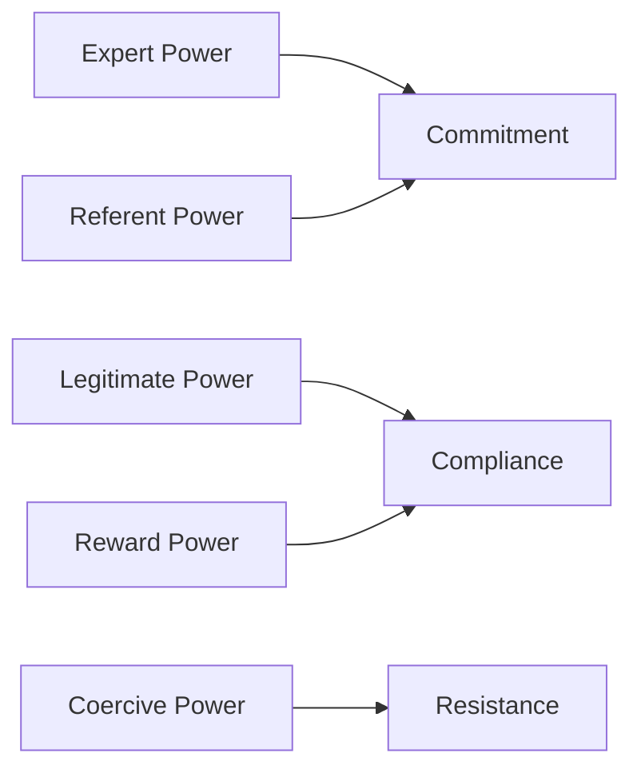

# Professional Skills — Week 8
## Power, Politics, and Organizational Culture

**Institution:** Sri Lanka Institute of Information Technology (SLIIT)  
**Module:** Professional Skills  
**Academic Year:** 2nd Year  
**Lecture / Lesson:** IT2090 Lecture 4A — Power and Politics in Organizational Context  
**Week:** Week 8  
**Lecture Title:** Power, Politics, and Organizational Culture  
**Lecturer:** Sanjeeva Perera — Senior Academic Fellow (SLIIT)  
**Total PDF Pages / Slides:** 30

---

# Table of Contents

- [Page 01 — Week 8: Power, Politics, and Organizational Culture](#page-01--week-8-power-politics-and-organizational-culture)
- [Page 02 — Module and Lesson Context](#page-02--module-and-lesson-context)
- [Page 03 — Lesson Learning Outcomes](#page-03--lesson-learning-outcomes)
- [Page 04 — Power](#page-04--power)
- [Page 05 — What is Power? Physics Meaning](#page-05--what-is-power-physics-meaning)
- [Page 06 — Definition of Power: Sociology and Political Science](#page-06--definition-of-power-sociology-and-political-science)
- [Page 07 — Power, Formal Authority, and Obedience](#page-07--power-formal-authority-and-obedience)
- [Page 08 — Concept of Power](#page-08--concept-of-power)
- [Page 09 — Dian Gomes: Farewell Tribute](#page-09--dian-gomes-farewell-tribute)
- [Page 10 — Five Forms of Power in the Workplace](#page-10--five-forms-of-power-in-the-workplace)
- [Page 11 — Reward Power](#page-11--reward-power)
- [Page 12 — Legitimate Power](#page-12--legitimate-power)
- [Page 13 — Coercive Power](#page-13--coercive-power)
- [Page 14 — Expert Power](#page-14--expert-power)
- [Page 15 — Referent / Charismatic Power](#page-15--referent--charismatic-power)
- [Page 16 — Question 1 Visual Prompt](#page-16--question-1-visual-prompt)
- [Page 17 — Question 1 and Answer](#page-17--question-1-and-answer)
- [Page 18 — Question 2 and Answer](#page-18--question-2-and-answer)
- [Page 19 — General Election 2010 Preferential Votes](#page-19--general-election-2010-preferential-votes)
- [Page 20 — General Election 2015 Preferential Votes](#page-20--general-election-2015-preferential-votes)
- [Page 21 — Consequences of Power](#page-21--consequences-of-power)
- [Page 22 — Political Behavior in Organizations](#page-22--political-behavior-in-organizations)
- [Page 23 — Leaders are Readers](#page-23--leaders-are-readers)
- [Page 24 — Political Strategies for Attaining Power](#page-24--political-strategies-for-attaining-power)
- [Page 25 — Neutralizing Potential Opposition](#page-25--neutralizing-potential-opposition)
- [Page 26 — Committing the Uncommitted](#page-26--committing-the-uncommitted)
- [Page 27 — Forming a Winning Coalition](#page-27--forming-a-winning-coalition)
- [Page 28 — Organizational Culture Definition](#page-28--organizational-culture-definition)
- [Page 29 — Organizational Culture Characteristics](#page-29--organizational-culture-characteristics)
- [Page 30 — Questions](#page-30--questions)
- [Key Definitions Table](#key-definitions-table)
- [Power Forms Comparison Table](#power-forms-comparison-table)
- [Important Visuals and Diagrams Summary](#important-visuals-and-diagrams-summary)
- [Likely Exam Questions and Short Answers](#likely-exam-questions-and-short-answers)
- [Common Mistakes to Avoid](#common-mistakes-to-avoid)
- [Final One-Page Revision Notes](#final-one-page-revision-notes)

---

# Page-by-Page Lecture Notes

## Page 01 — Week 8: Power, Politics, and Organizational Culture

### Original Slide Content

- **Week 8 – Power, Politics, and Organizational Culture**
- Focuses on how **power** and **political behavior** operate within organizations.
- Sanjeeva Perera — Senior Academic Fellow (SLIIT)

### Visual Explanation

The slide uses a **chess image** as the main visual. Chess represents strategy, planning, influence, control, and competition. This connects directly to the lecture because organizational power and politics often involve strategic moves, alliances, influence, and decision-making.

### Visual/Text Diagram

```text
Power + Politics + Culture
          ↓
How people influence decisions
          ↓
How organizations behave internally
          ↓
How goals are achieved or blocked
```

### Explanation

This lecture studies how individuals and groups use power inside organizations. Power is not only about official authority; it can also come from expertise, rewards, fear, personal attraction, or political strategy.

### Exam Tip

For exams, remember that this lecture connects **power sources**, **organizational politics**, and **organizational culture**.

### Common Mistake

Do not think power means only job position. Position is only one source of power.

---

## Page 02 — Module and Lesson Context

### Original Slide Content

- **Module:** Professional Skills
- **Academic Year:** 2nd Year
- **Lesson:** Power and Politics in Organizational Context
- **Contributing Disciplines:** Theories and concepts from Sociology, Psychology, and Political Science
- **IT2090 Lecture 4A — Power and Politics in Organizational Context**

### Visual Explanation

The slide includes a “Welcome to Our Class” visual and introduces the academic context. It shows that this topic is interdisciplinary.

### Explanation

Power and politics are not only management topics. They are connected to:

| Discipline | Contribution to this Topic |
|---|---|
| Sociology | Studies power relationships in groups and society |
| Psychology | Studies obedience, influence, motivation, and behavior |
| Political Science | Studies authority, power structures, coalitions, and strategies |

### Exam Tip

A possible short-answer question: **“Why is organizational power studied using sociology, psychology, and political science?”**

### Common Mistake

Do not treat this as only a business-management topic. The lecture clearly links it to multiple disciplines.

---

## Page 03 — Lesson Learning Outcomes

### Original Slide Content

Lesson LOs:

1. Identify sources of power
2. Explain organizational politics
3. Analyze political strategies for attaining power

### Visual Explanation

The slide shows the learning outcomes as three large horizontal blocks. This means these are the main targets of the lesson.

### Visual/Text Diagram

```text
Lesson Outcomes
├── 1. Sources of Power
├── 2. Organizational Politics
└── 3. Political Strategies for Attaining Power
```

### Explanation

By the end of the lecture, students should be able to identify where power comes from, explain how political behavior works inside organizations, and analyze strategies used to gain or maintain power.

### Exam Tip

These three outcomes are likely to become essay headings or structured answer parts.

### Common Mistake

Do not memorize only definitions. The lecture requires **analysis**, especially for political strategies and examples.

---

## Page 04 — Power

### Original Slide Content

- **Power**

### Visual Explanation

The slide shows a workplace-style image where one person appears to be explaining, directing, or influencing another person. It visually introduces power as interpersonal influence inside organizations.

### Explanation

This slide works as a transition into the topic of power. It prepares the learner to think about power as a relationship between people, not as a physical object.

### Visual/Text Diagram

```text
Person A has influence
          ↓
Person B changes behavior / decision / action
          ↓
Power relationship exists
```

### Exam Tip

Power questions often ask for a definition plus an example.

### Common Mistake

Do not define power only as “control.” In organizational behavior, power is usually about the **ability to influence**.

---

## Page 05 — What is Power? Physics Meaning

### Original Slide Content

- **Power**
- **What is Power? (Physics)**
- **Electric Power**
- Power is the rate at which work is done or energy is transferred.
- It is measured in watts (W).

### Visual Explanation

The slide shows an electric circuit with a battery and light bulb. It labels current flow and electron flow.

### Diagram Recreated in Markdown

```text
Physics Meaning of Power

Battery supplies energy
        ↓
Electric current flows through circuit
        ↓
Bulb converts electrical energy into light
        ↓
Power = rate of energy transfer
```

### Explanation

In physics, power measures how quickly work is done or energy is transferred. The lecture uses this basic meaning before moving to social and organizational meanings of power.

### Exam Tip

This slide is mainly introductory. In Professional Skills, the more important meaning is the **social / organizational meaning** of power.

### Common Mistake

Do not use the physics definition when answering organizational power questions unless the question specifically asks for it.

---

## Page 06 — Definition of Power: Sociology and Political Science

### Original Slide Content

- **Definition of Power**
- **What is Power? (Sociology and Political Science)**
- **Max Weber (pioneering sociologist)**
- The probability that one actor within a social relationship will be in a position to carry out his own will despite resistance.

### Visual Explanation

The slide shows Max Weber’s definition inside a large highlighted box. The visual emphasis means this is a key examinable definition.

### Definition

Power is the probability that one actor within a social relationship can carry out their own will even when others resist.

### Simple Meaning

Power means the ability to make something happen even when someone else disagrees or resists.

### Visual/Text Diagram

```text
Actor A wants something
        ↓
Actor B resists
        ↓
Actor A still gets it done
        ↓
Power is present
```

### Explanation

Max Weber’s definition focuses on **will** and **resistance**. Power becomes visible when there is disagreement, conflict, or resistance, but one person or group still gets their desired outcome.

### Exam Tip

Use keywords: **actor**, **social relationship**, **own will**, **despite resistance**.

### Common Mistake

Do not write only “power means authority.” Authority is a separate concept.

---

## Page 07 — Power, Formal Authority, and Obedience

### Original Slide Content

- **Power, formal authority, and obedience**
- **The Milgram experiments**
- Conducted by American social psychologist Stanley Milgram.
- The controversial and groundbreaking experiments on obedience to authority took place at Yale University in the early 1960s.
- Video: Milgram's Obedience to Authority Experiment

### Visual Explanation

The slide includes:

- A diagram of the Milgram experiment setup
- A picture of Stanley Milgram
- A black-and-white photo from the experiment

The experiment visual shows the relationship between **authority**, **obedience**, and human behavior.

### Diagram Recreated in Markdown

```text
Milgram Experiment Structure

Experimenter / Authority Figure
              ↓ gives instructions
Teacher / Participant
              ↓ administers shocks in experiment setting
Learner / Student
              ↓ receives apparent punishment
Obedience is tested under authority pressure
```

### Explanation

The Milgram experiment showed that ordinary people may obey authority figures even when the action causes discomfort or moral conflict. In organizational behavior, this helps explain how formal authority can strongly influence employee behavior.

### Exam Tip

This can appear as: **“Explain how formal authority can influence obedience using Milgram’s experiment.”**

### Common Mistake

Do not explain Milgram as only “power.” The key idea is **obedience to authority**.

---

## Page 08 — Concept of Power

### Original Slide Content

- **Concept of Power**
- **Power** — the ability to influence another person
- **Authority** — the right to influence another person
- Dian Gomes, Chairman at Hela Clothing, ex-Managing Director of MAS Holdings
- Mahesh Amalean, Co-Founder & Chairman of MAS Holdings

### Visual Explanation

The slide shows two Sri Lankan business leaders as examples connected to organizational influence and authority.

### Comparison Table

| Concept | Meaning | Key Point | Example |
|---|---|---|---|
| Power | Ability to influence another person | Can come from many sources | Expert knowledge, personal charisma, control of rewards |
| Authority | Right to influence another person | Comes from accepted position or role | Manager assigning duties |

### Visual/Text Diagram

```text
Power = ability to influence
Authority = right to influence

Authority is one possible source of power,
but power can exist even without formal authority.
```

### Explanation

Power is broader than authority. A person may have power because others respect them, need their expertise, fear punishment, or want rewards. Authority is more formal and comes from a recognized role or position.

### Exam Tip

A very likely exam question: **“Differentiate power and authority.”**

### Common Mistake

Do not say power and authority are the same. Authority is formal right; power is influence ability.

---

## Page 09 — Dian Gomes: Farewell Tribute

### Original Slide Content

- **Dian Gomes: A Heartfelt Farewell Tribute from MAS Intimates**

### Visual Explanation

The slide shows a large black-and-white group image related to Dian Gomes. The visual suggests recognition, emotional connection, respect, and influence among people.

### Explanation

This slide likely supports the idea that leadership influence can go beyond official authority. A farewell tribute suggests the leader had personal influence, respect, and possibly referent/charismatic power.

### Visual/Text Diagram

```text
Leader's actions / personality
          ↓
Employee respect and emotional connection
          ↓
Influence continues beyond job title
          ↓
Referent or charismatic power may develop
```

### Exam Tip

Use this type of example when explaining **referent power** or **charismatic influence**.

### Common Mistake

Do not assume every senior leader only has legitimate power. They may also have expert, referent, reward, or coercive power.

---

## Page 10 — Five Forms of Power in the Workplace

### Original Slide Content

- **The five forms of power in the workplace**
- In a notable study of power conducted by American social psychologists **John R. P. French** and **Bertram Raven** in 1959, power was divided into five separate and distinct forms.
- They developed the concept of the five bases of power through a combination of theoretical analysis and empirical research.

### Visual Explanation

The slide includes images of French and Raven and highlights the five bases of power as a major theory.

### Diagram Recreated in Markdown

```text
French and Raven's Five Bases of Power

Power
├── Reward Power
├── Legitimate Power
├── Coercive Power
├── Expert Power
└── Referent / Charismatic Power
```

### Explanation

French and Raven’s framework explains different reasons why one person can influence another. These five forms are central to this lecture.

### Exam Tip

Memorize all five forms and one example for each.

### Common Mistake

Do not mix **reward power** and **coercive power**. Reward power uses benefits; coercive power uses punishment or unpleasant consequences.

---

## Page 11 — Reward Power

### Original Slide Content

- **Reward Power**
- Agent’s ability to control the rewards that the target wants.

### Visual Explanation

The slide shows a MAS Holdings employee incentive program visual. It includes examples such as:

- Structured performance-based incentives
- Bonuses
- Promotions
- Overseas training
- Employee recognition programs

### Table: Reward Power Example

| Element | Meaning in Reward Power |
|---|---|
| Agent | Person or organization controlling rewards |
| Target | Employee who wants the reward |
| Reward | Bonus, promotion, recognition, training opportunity |
| Influence Method | Employee is influenced because they want the benefit |

### Explanation

Reward power exists when someone can influence others by offering something valuable. In an organization, managers may influence employees using salary increases, promotions, recognition, or training opportunities.

### Visual/Text Diagram

```text
Manager controls reward
          ↓
Employee wants reward
          ↓
Employee changes behavior / improves performance
          ↓
Reward power works
```

### Exam Tip

Keywords: **control rewards**, **target wants**, **incentives**, **benefits**.

### Common Mistake

Do not confuse reward power with referent power. Reward power depends on benefits, not personal admiration.

---

## Page 12 — Legitimate Power

### Original Slide Content

- **Legitimate Power**
- Agent and target agree that agent has influential rights, based on position and mutual agreement.
- Example: The Factory Manager may assign shift schedules, approve leave, or enforce safety protocols. Employees follow these directions because they acknowledge the manager’s right to make such decisions based on his/her position within the company.

### Visual Explanation

The slide shows a factory manager with employees. This represents formal workplace authority.

### Table: Legitimate Power Example

| Role | Meaning |
|---|---|
| Agent | Factory Manager |
| Target | Employees |
| Source of Power | Official position |
| Actions | Assign shift schedules, approve leave, enforce safety protocols |
| Why employees obey | They accept the manager’s right to direct them |

### Visual/Text Diagram

```text
Official position / job role
          ↓
Accepted right to give instructions
          ↓
Employees follow instructions
          ↓
Legitimate power
```

### Explanation

Legitimate power comes from a formal position. It works when employees accept that the person has the right to give orders or make decisions.

### Exam Tip

Use job title or official position as the key clue when identifying legitimate power.

### Common Mistake

Do not call every successful action “expert power.” If the power mainly comes from position, it is legitimate power.

---

## Page 13 — Coercive Power

### Original Slide Content

- **Coercive Power**
- Agent’s ability to cause an unpleasant experience for a target.
- Example: When a worker consistently fails to meet daily production quotas or violates safety rules, the supervisor warns the worker of possible disciplinary action.

### Visual Explanation

The image shows a supervisor warning or pressuring a worker in a factory environment. This visual represents threat, punishment, and disciplinary control.

### Table: Coercive Power Example

| Element | Meaning |
|---|---|
| Agent | Supervisor |
| Target | Worker |
| Source of Power | Ability to punish or discipline |
| Example Action | Warning about disciplinary action |
| Result | Worker may comply due to fear of consequences |

### Visual/Text Diagram

```text
Target fails quota / violates rules
          ↓
Supervisor warns target
          ↓
Possible punishment / disciplinary action
          ↓
Target complies to avoid unpleasant result
```

### Explanation

Coercive power is based on the ability to punish or create negative consequences. It can produce compliance, but it can also cause resistance, fear, or low morale.

### Exam Tip

Keywords: **punishment**, **discipline**, **threat**, **unpleasant experience**, **fear of consequences**.

### Common Mistake

Do not call strict supervision “legitimate power” automatically. If the focus is punishment or unpleasant consequences, it is coercive power.

---

## Page 14 — Expert Power

### Original Slide Content

- **Expert Power**
- Agent has knowledge target needs.
- Example: Textile Engineer advising on fabric optimization. MAS Holdings employs textile engineers and R&D specialists who have deep expertise in fabric technology, sustainability, and production efficiency.

### Visual Explanation

The image shows a discussion involving textile/fabric expertise. It represents knowledge-based influence.

### Table: Expert Power Example

| Element | Meaning |
|---|---|
| Agent | Textile Engineer / R&D Specialist |
| Target | Person or team needing technical knowledge |
| Source of Power | Specialized knowledge |
| Example Area | Fabric technology, sustainability, production efficiency |
| Reason for Influence | Others depend on the expert’s knowledge |

### Visual/Text Diagram

```text
Specialist knowledge
          ↓
Others need that knowledge
          ↓
They accept advice / direction
          ↓
Expert power
```

### Explanation

Expert power comes from knowledge, skill, or experience that others need. This type of power is common in technical roles, consulting, engineering, medicine, IT, and R&D.

### Exam Tip

When the case mentions **knowledge**, **innovation**, **skill**, or **expertise**, expert power is usually the correct answer.

### Common Mistake

Do not choose legitimate power just because the person has a job title. If influence comes mainly from knowledge, choose expert power.

---

## Page 15 — Referent / Charismatic Power

### Original Slide Content

- **Referent (Charismatic) Power**
- Based on interpersonal attraction — timing matters.
- Example: During a critical production delay or market challenge, a young, energetic team leader at MAS Holdings rallies her team not through formal authority, but through her personal charm, trustworthiness, and passion.

### Visual Explanation

The slide shows a confident team leader speaking with a group. The visual emphasizes personal appeal, trust, passion, and influence without depending only on authority.

### Table: Referent / Charismatic Power Example

| Element | Meaning |
|---|---|
| Agent | Energetic team leader |
| Target | Team members |
| Source of Power | Personal charm, trustworthiness, passion |
| Context | Production delay or market challenge |
| Important Note | Timing matters |

### Visual/Text Diagram

```text
Personal charm + trust + passion
          ↓
Followers admire / identify with leader
          ↓
Leader rallies team during challenge
          ↓
Referent / charismatic power
```

### Explanation

Referent power is based on attraction, admiration, and identification. Charismatic power is a form of referent power where the person’s personality and timing create influence.

### Exam Tip

Keywords: **personal charm**, **admiration**, **trust**, **appeal**, **charisma**, **timing**.

### Common Mistake

Do not confuse charisma with expertise. Popularity and personal appeal are not the same as technical knowledge.

---

## Page 16 — Question 1 Visual Prompt

### Original Slide Content

- **Question 1**

### Visual Explanation

The slide shows garbage collection trucks and an image related to Karu Jayasuriya / United National Party. It prepares the next slide’s MCQ about what type of power was used in improving Colombo waste management.

### Explanation

This slide is a visual case prompt. The key context is urban waste management improvement under a political/municipal leader.

### Exam Tip

When a question includes a practical improvement or innovation, check whether the power came from **position** or **knowledge/innovation**.

### Common Mistake

Do not answer from the image only. Read the full case before selecting the power type.

---

## Page 17 — Question 1 and Answer

### Original Slide Content

**Question:**  
During his tenure from 1997–1999 as Mayor of Colombo Municipal Council, Karu Jayasuriya introduced a new method of garbage collection that significantly improved waste management in the city. Which type of power did Karu Jayasuriya most likely exercise through this initiative?

A. Legitimate Power — His power was based on his official position as Mayor of Colombo.  
B. Expert Power — His power was based on his knowledge and innovative approach to urban management and waste disposal.  
C. Reward Power — His power was based on the incentives provided to municipal workers for effective garbage collection.  
D. Referent Power — His power was based on the respect and admiration he gained from residents for improving the city’s cleanliness.

**Answer: B**

### Visual Explanation

The slide includes Karu Jayasuriya’s image and the answer box showing **Answer: B**.

### Answer Explanation

The correct answer is **B. Expert Power** because the case emphasizes his **knowledge and innovative approach** to solving an urban management problem.

### Decision Table

| Option | Why It May Look Correct | Why Correct / Incorrect |
|---|---|---|
| A. Legitimate Power | He was Mayor | Not the main reason highlighted in the question |
| B. Expert Power | Innovation and urban-management knowledge | Correct |
| C. Reward Power | Could involve municipal workers | No reward/incentive focus in question |
| D. Referent Power | Residents may admire him | Admiration is an outcome, not the main source of power here |

### Exam Tip

For MCQs, identify the phrase that reveals the source of power. Here the phrase is **“new method”** and **“improved waste management”**.

### Common Mistake

Choosing legitimate power just because the person held a formal office. The question asks the power exercised **through the initiative**, not just through the position.

---

## Page 18 — Question 2 and Answer

### Original Slide Content

**Question:**  
Upkesha Swarnamali, a well-known Paba teledrama actress in 2008, leveraged her popularity when she contested in the 2010 General Election. Which type of power did Upkesha Swarnamali primarily utilize in her political campaign?

A. Legitimate Power — Her power was derived from an official position she held before the election.  
B. Reward Power — Her power was based on her ability to offer incentives or benefits to her supporters.  
C. Coercive Power — Her power was based on the ability to impose penalties or sanctions.  
D. Charismatic Power — Her power was based on her personal charm, appeal, and influence over the public.

**Answer: D**

### Visual Explanation

The slide includes an image of Upkesha Swarnamali and an answer box showing **Answer: D**.

### Answer Explanation

The correct answer is **D. Charismatic Power** because the question highlights her **popularity**, **personal charm**, and **public appeal**.

### Decision Table

| Option | Why Correct / Incorrect |
|---|---|
| A. Legitimate Power | Incorrect because she did not use an official position before election |
| B. Reward Power | Incorrect because offering incentives is not mentioned |
| C. Coercive Power | Incorrect because punishment or sanctions are not mentioned |
| D. Charismatic Power | Correct because the source is popularity and personal appeal |

### Exam Tip

If the case says **fame, popularity, public appeal, personality, admiration**, the answer is usually **charismatic/referent power**.

### Common Mistake

Do not select reward power just because political campaigns sometimes promise benefits. The case specifically focuses on popularity.

---

## Page 19 — General Election 2010 Preferential Votes

### Original Slide Content

- **General Election 2010 — Preferential Votes**
- **Gampaha District — UNP**
- Upeksha Swarnamali — Teledrama Actress — Charismatic Power
- Preferential Votes — 81,350
- Karu Jayasuriya — Veteran Politician — Expert Power
- Preferential Votes — 60,310

### Visual Explanation

The slide compares Upeksha Swarnamali and Karu Jayasuriya using photos, roles, power types, and vote counts.

### Table Recreated from Slide

| Candidate | Public Identity | Power Type | Preferential Votes |
|---|---|---:|---:|
| Upeksha Swarnamali | Teledrama Actress | Charismatic Power | 81,350 |
| Karu Jayasuriya | Veteran Politician | Expert Power | 60,310 |

### Comparison Diagram

```text
2010 Gampaha District - UNP

Upeksha Swarnamali
Teledrama Actress → Charismatic Power → 81,350 votes

Karu Jayasuriya
Veteran Politician → Expert Power → 60,310 votes
```

### Explanation

This slide shows that charismatic power can be highly effective when timing, popularity, and public attention align. It also contrasts charismatic influence with expert power.

### Exam Tip

This is useful for explaining **timing in charismatic power** and how different power types can produce different outcomes.

### Common Mistake

Do not conclude charismatic power is always stronger than expert power. The next slide shows timing matters.

---

## Page 20 — General Election 2015 Preferential Votes

### Original Slide Content

- **General Election 2015 — Preferential Votes**
- **Gampaha District — UNP**
- Ranjan Ramanayake — Veteran Actor — Charismatic Power
- Preferential Votes — 216,463
- Arjuna Ranatunga — Ex Cricket Captain — Charismatic Power
- Preferential Votes — 165,890
- Upeksha Swarnamali chose not to contest in the 2015 Election
- **Charismatic Power — The Importance of Timing**
- Upeksha's Struggle to Sustain Influence

### Visual Explanation

The slide compares two famous public figures and emphasizes that charisma depends strongly on public mood and timing.

### Table Recreated from Slide

| Candidate | Public Identity | Power Type | Preferential Votes |
|---|---|---:|---:|
| Ranjan Ramanayake | Veteran Actor | Charismatic Power | 216,463 |
| Arjuna Ranatunga | Ex Cricket Captain | Charismatic Power | 165,890 |
| Upeksha Swarnamali | Former teledrama actress / politician | Charismatic Power issue | Did not contest |

### Timeline Diagram

```text
2010 Election
Upeksha's popularity was strong
        ↓
Charismatic power produced electoral influence
        ↓
2015 Election
Upeksha did not contest
        ↓
Shows charisma may fade if timing changes
```

### Explanation

Charismatic power is often connected to timing. Public attention and emotional connection may be strong at one moment but may not remain strong forever.

### Exam Tip

Use the phrase **“Charismatic power depends on timing and sustained public appeal.”**

### Common Mistake

Do not assume charisma is permanent. The lecture clearly says timing matters.

---

## Page 21 — Consequences of Power

### Original Slide Content

- **Consequences of Power**
- Sources of Power
  - Reward Power
  - Legitimate Power
  - Coercive Power
  - Expert Power
  - Referent Power
- Consequences of Power
  - Commitment
  - Compliance
  - Resistance
- Followers for over two thousand years

### Visual Explanation

The slide visually maps sources of power to consequences. It implies that different power sources lead to different responses from followers.

### Diagram Recreated in Markdown

```text
Sources of Power                      Consequences of Power

Expert Power       ────────────────→   Commitment
Referent Power     ────────────────→   Commitment

Legitimate Power   ────────────────→   Compliance
Reward Power       ────────────────→   Compliance

Coercive Power     ────────────────→   Resistance
```

### Mermaid Diagram



### Explanation

Power does not always create the same response. Expert and referent power are more likely to create commitment because people genuinely believe, trust, or admire the source. Legitimate and reward power often create compliance because people follow instructions or want rewards. Coercive power can create resistance because people dislike being threatened.

### Exam Tip

This is highly examinable. Remember the grouping:

| Consequence | Likely Power Sources |
|---|---|
| Commitment | Expert, Referent |
| Compliance | Legitimate, Reward |
| Resistance | Coercive |

### Common Mistake

Do not write that all power causes commitment. Badly used power can cause resistance.

---

## Page 22 — Political Behavior in Organizations

### Original Slide Content

- **Political Behavior in Organizations**
- Politics in organizations is simply a fact of life.
- Political Behavior — Actions not officially sanctioned / authorized by an organization that are taken to influence others in order to meet one’s personal goals.
- Stephen P. Robbins

### Visual Explanation

No major technical diagram. The slide emphasizes the definition in text form.

### Definition

Political behavior refers to actions not officially authorized by an organization, taken to influence others to meet personal goals.

### Simple Meaning

Organizational politics means people using informal influence to get what they want inside the workplace.

### Visual/Text Diagram

```text
Personal goal
      ↓
Unofficial action / informal influence
      ↓
Influence others
      ↓
Goal achieved or protected
```

### Explanation

Politics exists in organizations because people have different goals, limited resources, competition, ambitions, and relationships. Not all politics is illegal or unethical, but it is not usually part of the official job description.

### Exam Tip

Use keywords: **not officially sanctioned**, **influence others**, **personal goals**.

### Common Mistake

Do not define organizational politics only as “corruption.” Politics can include informal influence, alliances, impression management, and strategic communication.

---

## Page 23 — Leaders are Readers

### Original Slide Content

- **Political Behavior in Organizations**
- Leaders are Readers
- **How to Win Friends and Influence People** — Dale Carnegie, 1998
- Quote: “Always make the other person feel important…and do it sincerely. Please, thank you and Would you mind?...”
- How to Win Friends and Influence People 9 points — Video
- How to Win Friends and Influence People — Video

### Visual Explanation

The slide uses a reading/leadership message to connect influence skills with political behavior.

### Explanation

This slide shows that influence is not always forceful. Leaders can gain influence through respect, communication, politeness, and making others feel valued.

### Visual/Text Diagram

```text
Respectful communication
        ↓
Other person feels important
        ↓
Trust and goodwill increase
        ↓
Influence becomes easier
```

### Exam Tip

This slide can support answers about **soft power**, **interpersonal influence**, and **ethical political behavior**.

### Common Mistake

Do not think political behavior always means manipulation. It can include positive influence through sincere respect.

---

## Page 24 — Political Strategies for Attaining Power

### Original Slide Content

Political Strategies for Attaining Power in Organization:

- Taking counsel
- Maintaining maneuverability
- Promoting limited communication
- Exhibiting confidence
- Controlling access to information and persons
- Making activities central and nonsubstitutable
- Creating a sponsor–protégé relationship
- Stimulating competition among ambitious subordinates
- Neutralizing potential opposition
- Making strategic replacements
- Committing the uncommitted
- Forming a winning coalition
- Developing expertise
- Building personal stature
- Employing trade-offs
- Using research data to support one’s own point of view
- Restricting communication about real intentions
- Withdrawing from petty disputes

### Visual Explanation

The slide is a list of political strategies. Since it is dense, the best way to understand it is through a categorized table.

### Organized Strategy Table

| Strategy Category | Strategies from Slide | Simple Meaning |
|---|---|---|
| Advice and positioning | Taking counsel, maintaining maneuverability | Get advice and keep options open |
| Information control | Promoting limited communication, controlling access to information and persons, restricting communication about real intentions | Control what others know and when they know it |
| Image and confidence | Exhibiting confidence, building personal stature | Look capable and trustworthy |
| Structural importance | Making activities central and nonsubstitutable | Make your work difficult to replace |
| Relationship building | Creating sponsor–protégé relationship, forming a winning coalition | Build support networks |
| Competition management | Stimulating competition among ambitious subordinates | Use ambition to increase performance or alignment |
| Opposition handling | Neutralizing potential opposition, making strategic replacements | Reduce threats to your agenda |
| Commitment building | Committing the uncommitted | Convert neutral people into supporters |
| Expertise building | Developing expertise, using research data to support one’s own point of view | Use knowledge and evidence as influence tools |
| Negotiation | Employing trade-offs | Give something to gain something |
| Conflict avoidance | Withdrawing from petty disputes | Avoid wasting political capital |

### Visual/Text Diagram

```text
Political Power Strategy
├── Control information
├── Build alliances
├── Develop expertise
├── Manage opposition
├── Build personal image
├── Use trade-offs
└── Avoid unnecessary disputes
```

### Explanation

These strategies show how people gain and maintain influence in organizations. Some strategies can be ethical, such as developing expertise or using research data. Others can become risky or manipulative if misused, such as restricting communication or neutralizing opposition.

### Exam Tip

For essay questions, group strategies into categories instead of writing the whole list randomly.

### Common Mistake

Do not memorize the list without understanding. Exam answers need examples and analysis.

---

## Page 25 — Neutralizing Potential Opposition

### Original Slide Content

- **Political Strategies for Attaining Power in Organization**
- **Neutralizing potential opposition**
- Government might mobilize public opinion via government-aligned media, town halls, or social media, framing elite critics as “protectors of the corrupt old system.”

### Visual Explanation

No major visual diagram. The slide gives a political example.

### Explanation

Neutralizing potential opposition means reducing the influence of people or groups who may resist your agenda. In the example, the government uses media, public meetings, or social media to shape public opinion and weaken critics.

### Visual/Text Diagram

```text
Potential opposition exists
          ↓
Leader / group shapes public narrative
          ↓
Opposition is framed negatively
          ↓
Opposition influence is reduced
```

### Exam Tip

Use this as an example of **managing opposition through public opinion and communication control**.

### Common Mistake

Do not confuse neutralizing opposition with winning coalition. Neutralizing opposition weakens blockers; forming coalition builds supporters.

---

## Page 26 — Committing the Uncommitted

### Original Slide Content

- **Political Strategies for Attaining Power in Organization**
- **Committing the uncommitted**
- Corporate Example — MAS Holdings
- Scenario: MAS wanted to improve engagement among factory floor employees who were not emotionally invested in company goals.
- To commit the uncommitted:
  - MAS launched a “Voice of the Employee” program, encouraging workers to suggest improvements.
  - Recognized suggestions were implemented publicly, and employees were rewarded.
  - This gave previously disengaged workers a sense of ownership, increasing commitment and performance.

### Visual Explanation

No major visual diagram. The slide uses a corporate example.

### Process Diagram

```text
Disengaged employees
          ↓
Voice of the Employee program
          ↓
Workers suggest improvements
          ↓
Good suggestions implemented publicly
          ↓
Employees rewarded and recognized
          ↓
Ownership increases
          ↓
Commitment and performance improve
```

### Explanation

Committing the uncommitted means turning neutral or disengaged people into active supporters. The MAS example shows how participation, recognition, and rewards can create ownership.

### Exam Tip

This example is strong for essay answers on political strategies because it is concrete and workplace-based.

### Common Mistake

Do not describe this as coercive power. Employees are not forced; they are engaged and recognized.

---

## Page 27 — Forming a Winning Coalition

### Original Slide Content

- **Political Strategies for Attaining Power in Organization**
- **Forming a winning coalition**
- Example: President Maithripala Sirisena’s 2015 Victory
- In the 2015 Presidential Election, Maithripala Sirisena, a former SLFP minister, broke away from the Rajapaksa regime and ran as a common opposition candidate.
- To form a winning coalition, he united multiple opposition parties, including the UNP, JHU, TNA, and civil society organizations.
- Appealed to minority communities (Tamils and Muslims) and moderate Sinhalese voters.
- Positioned the coalition as a movement for democratic change, good governance, and anti-corruption.
- This broad alliance, despite ideological differences, had a common goal: defeating Mahinda Rajapaksa. Together, they secured a surprise win — a classic example of forming a winning coalition to achieve a strategic objective.

### Visual Explanation

No major diagram. The slide is a political case study.

### Coalition Diagram

```text
Common Strategic Objective
Defeat Mahinda Rajapaksa / Create change
          ↑
          |
UNP ──────┤
JHU ──────┤
TNA ──────┤──→ Winning Coalition
Civil Society ─┤
Minority Communities ─┤
Moderate Sinhalese Voters ─┘
```

### Explanation

A winning coalition is formed when different groups join around a shared goal, even if they have different ideologies or interests. The strategic skill is to create a common purpose strong enough to unite them.

### Exam Tip

Use the terms: **broad alliance**, **common objective**, **strategic coalition**, **different groups**, **shared goal**.

### Common Mistake

Do not say coalition means everyone has the same ideology. Coalitions often work because different groups temporarily agree on one strategic objective.

---

## Page 28 — Organizational Culture Definition

### Original Slide Content

- **Organizational Culture**
- **Definition**
- A pattern of basic assumptions, invented, discovered, or developed by a given group as it learns to cope with its problems of external adaptation and internal integration — that has worked well enough to be considered valuable and, therefore, to be taught to new members as the correct way to perceive, think, and feel in relation to those problems.

### Visual Explanation

The slide presents a formal definition. It is dense, so the meaning should be broken down.

### Definition Breakdown Table

| Part of Definition | Simple Meaning |
|---|---|
| Pattern of basic assumptions | Shared beliefs and ways of thinking |
| Invented, discovered, or developed by a group | Culture forms through experience |
| External adaptation | How the organization handles outside challenges |
| Internal integration | How members work together internally |
| Worked well enough | The behavior or belief was successful |
| Taught to new members | New employees learn it as the “correct way” |
| Perceive, think, and feel | Culture shapes how members understand and respond to situations |

### Visual/Text Diagram

```text
Organization faces problems
        ↓
Group develops ways to solve them
        ↓
Some methods work well
        ↓
Those methods become accepted assumptions
        ↓
New members are taught them
        ↓
Organizational culture is formed
```

### Explanation

Organizational culture is the shared way members think, behave, and respond to problems. It is not only written rules. It includes assumptions, values, habits, and accepted practices.

### Exam Tip

For an exam definition, include: **shared assumptions**, **external adaptation**, **internal integration**, **taught to new members**.

### Common Mistake

Do not define culture only as office traditions or events. Organizational culture is deeper: assumptions, values, behavior, and accepted ways of working.

---

## Page 29 — Organizational Culture Characteristics

### Original Slide Content

**Organizational Culture — Important characteristics:**

1. Observed behavioral regularities, e.g., common language and terminology
2. Norms, e.g., guidelines on how much work to do
3. Dominant values, e.g., high product quality, low absenteeism, and high efficiency
4. Philosophy, e.g., organization’s beliefs about how employees and customers are to be treated
5. Rules
6. Organizational climate, e.g., the way participants interact and the way members conduct themselves with customers or outsiders

### Visual Explanation

The slide lists six major characteristics of organizational culture. It is best represented as a structured table.

### Table Recreated and Improved

| No. | Characteristic | Meaning | Example from Slide |
|---:|---|---|---|
| 1 | Observed behavioral regularities | Common repeated behavior among members | Common language, terminology |
| 2 | Norms | Expected standards of behavior | Guidelines on how much work to do |
| 3 | Dominant values | Major values the organization prioritizes | High product quality, low absenteeism, high efficiency |
| 4 | Philosophy | Beliefs about how people should be treated | How employees and customers are treated |
| 5 | Rules | Formal or informal instructions members follow | Workplace rules, procedures, policies |
| 6 | Organizational climate | General atmosphere and interaction style | How members interact with each other and outsiders |

### Visual/Text Diagram

```text
Organizational Culture
├── Behavioral regularities
├── Norms
├── Dominant values
├── Philosophy
├── Rules
└── Organizational climate
```

### Explanation

These six characteristics help identify the real culture of an organization. Culture can be seen through daily behavior, language, work standards, values, beliefs, rules, and the emotional climate of the workplace.

### Exam Tip

A likely question: **“Explain the important characteristics of organizational culture with examples.”**

### Common Mistake

Do not list the six characteristics without examples. Add at least one example for each.

---

## Page 30 — Questions

### Original Slide Content

- **Questions?**

### Visual Explanation

The slide closes the lecture and invites discussion.

### Explanation

This marks the end of the lecture. The main examinable areas are:

- Definitions of power and authority
- Five forms of power
- Consequences of power
- Political behavior definition
- Political strategies
- Organizational culture definition and characteristics

### Exam Tip

Use this page as a revision checkpoint. If you cannot explain each bullet above, the lecture is not fully covered.

### Common Mistake

Do not revise only the five powers. The lecture also covers politics and culture.

---

# Full Lecture Summary

This lecture explains how power, politics, and organizational culture operate within organizations. It begins by defining power from physics and then shifts to the social-science meaning of power through Max Weber’s definition: the ability of one actor to carry out their will despite resistance.

The lecture differentiates **power** and **authority**. Power is the ability to influence another person, while authority is the right to influence another person. It then introduces French and Raven’s five forms of workplace power: reward, legitimate, coercive, expert, and referent/charismatic power.

The lecture uses workplace and Sri Lankan examples to explain power types. Reward power comes from controlling rewards. Legitimate power comes from accepted position. Coercive power comes from the ability to punish. Expert power comes from knowledge others need. Referent or charismatic power comes from interpersonal attraction, trust, admiration, and timing.

The lecture then explains the consequences of power. Expert and referent power often lead to commitment. Legitimate and reward power often lead to compliance. Coercive power can lead to resistance.

Organizational politics is defined as actions not officially authorized by an organization that are taken to influence others in order to meet personal goals. Political strategies include controlling information, forming coalitions, developing expertise, neutralizing opposition, committing the uncommitted, and using research data.

Finally, the lecture introduces organizational culture as shared assumptions developed by a group to solve internal and external problems. Important characteristics include behavioral regularities, norms, dominant values, philosophy, rules, and organizational climate.

---

# Key Definitions Table

| Term | Meaning | Example |
|---|---|---|
| Power | Ability to influence another person | A respected expert influences a team decision |
| Authority | Right to influence another person | A manager assigns shifts |
| Weber’s Power Definition | Ability to carry out one’s will despite resistance | A leader implements a decision despite opposition |
| Reward Power | Power from controlling rewards others want | Bonuses, promotions, recognition |
| Legitimate Power | Power from accepted position or role | Factory manager approving leave |
| Coercive Power | Power from ability to punish or create unpleasant consequences | Disciplinary warning |
| Expert Power | Power from knowledge or skill others need | Textile engineer advising on fabric optimization |
| Referent / Charismatic Power | Power from admiration, attraction, trust, or personal appeal | Popular public figure gaining support |
| Political Behavior | Unofficial actions used to influence others to meet personal goals | Forming alliances to support a proposal |
| Coalition | Group alliance formed around a common goal | Multiple parties supporting one candidate |
| Organizational Culture | Shared assumptions, values, and accepted ways of working | New employees learning how the organization expects them to behave |
| Organizational Climate | The general atmosphere and interaction style in an organization | Friendly, strict, innovative, or customer-focused climate |

---

# Power Forms Comparison Table

| Power Type | Main Source | Typical Result | Example | Risk |
|---|---|---|---|---|
| Reward Power | Rewards and benefits | Compliance | Bonuses, promotions | People may work only for rewards |
| Legitimate Power | Formal position | Compliance | Manager giving instructions | Weak if authority is not respected |
| Coercive Power | Punishment or threat | Resistance or forced compliance | Disciplinary action | Fear, low morale, resistance |
| Expert Power | Knowledge and skill | Commitment | Technical expert advising team | Can weaken if expertise becomes outdated |
| Referent / Charismatic Power | Personal appeal and admiration | Commitment | Popular leader rallying team | Timing-dependent and may fade |

---

# Political Strategies Summary Table

| Strategy | Meaning | Example |
|---|---|---|
| Taking counsel | Seeking advice before acting | Consulting senior colleagues |
| Maintaining maneuverability | Keeping options open | Avoiding early commitment |
| Promoting limited communication | Controlling how much information is shared | Sharing only necessary information |
| Exhibiting confidence | Showing certainty and competence | Presenting a plan strongly |
| Controlling access to information and persons | Managing who knows what and who meets whom | Gatekeeping key data |
| Making activities central and nonsubstitutable | Making your role essential | Owning a critical process |
| Creating sponsor–protégé relationship | Building mentor-support links | Senior manager supports junior employee |
| Stimulating competition | Using ambition to increase effort | Competitive internal targets |
| Neutralizing potential opposition | Reducing blockers’ influence | Framing critics negatively |
| Making strategic replacements | Replacing people who block strategy | Changing key role holders |
| Committing the uncommitted | Turning neutral people into supporters | Voice of the Employee program |
| Forming a winning coalition | Building a strong alliance | Common opposition candidate example |
| Developing expertise | Gaining knowledge-based influence | Becoming a technical specialist |
| Building personal stature | Increasing reputation | Becoming known as reliable and competent |
| Employing trade-offs | Giving something to gain support | Supporting another team’s request in exchange |
| Using research data | Supporting arguments with evidence | Data-backed proposal |
| Restricting communication about intentions | Keeping strategy hidden | Avoid revealing negotiation plans early |
| Withdrawing from petty disputes | Avoiding low-value conflict | Ignoring minor office arguments |

---

# Important Visuals and Diagrams Summary

| Page | Visual / Diagram | Meaning |
|---:|---|---|
| 1 | Chess image | Power and politics involve strategy and planned moves |
| 4 | Workplace influence image | Power operates between people in organizations |
| 5 | Electric circuit | Introduces physics meaning of power before social meaning |
| 7 | Milgram experiment visuals | Shows obedience to authority |
| 8 | Business leader examples | Shows power and authority in organizational leadership |
| 10 | French and Raven images | Introduces five bases of power theory |
| 11 | MAS incentive program | Demonstrates reward power |
| 12 | Factory manager with employees | Demonstrates legitimate power |
| 13 | Supervisor warning worker | Demonstrates coercive power |
| 14 | Textile engineer discussion | Demonstrates expert power |
| 15 | Team leader discussion | Demonstrates referent / charismatic power |
| 19 | 2010 election vote comparison | Shows charismatic vs expert power in politics |
| 20 | 2015 election vote comparison | Shows timing in charismatic power |
| 21 | Sources and consequences of power | Maps power sources to commitment, compliance, resistance |
| 28 | Culture definition layout | Shows organizational culture as learned assumptions |
| 29 | Culture characteristics list | Shows six culture features |

---

# Likely Exam Questions and Short Answers

## Question 1
Define power according to Max Weber.

**Expected Answer:**  
Power is the probability that one actor within a social relationship can carry out his or her own will despite resistance.

## Question 2
Differentiate power and authority.

**Expected Answer:**  
Power is the ability to influence another person. Authority is the right to influence another person, usually based on an accepted role or position.

## Question 3
List French and Raven’s five forms of power.

**Expected Answer:**  
Reward power, legitimate power, coercive power, expert power, and referent/charismatic power.

## Question 4
Explain reward power with an example.

**Expected Answer:**  
Reward power is the agent’s ability to control rewards that the target wants. Example: a manager influencing employees through bonuses, promotions, overseas training, or recognition programs.

## Question 5
Explain legitimate power with an example.

**Expected Answer:**  
Legitimate power is based on an accepted position or official role. Example: a factory manager assigning shifts or approving leave because employees accept the manager’s right to make those decisions.

## Question 6
Explain coercive power with an example.

**Expected Answer:**  
Coercive power is the ability to create unpleasant consequences for a target. Example: a supervisor warning a worker about disciplinary action for violating safety rules.

## Question 7
Explain expert power with an example.

**Expected Answer:**  
Expert power comes from knowledge or skill that others need. Example: a textile engineer influencing production decisions because of expertise in fabric optimization.

## Question 8
Explain referent or charismatic power.

**Expected Answer:**  
Referent or charismatic power is based on interpersonal attraction, trust, admiration, personal charm, and timing. A popular actor or trusted team leader can influence others through personal appeal.

## Question 9
What are the consequences of different sources of power?

**Expected Answer:**  
Expert and referent power often create commitment. Legitimate and reward power often create compliance. Coercive power may create resistance.

## Question 10
Define political behavior in organizations.

**Expected Answer:**  
Political behavior refers to actions not officially authorized by an organization that are taken to influence others to meet personal goals.

## Question 11
Explain “committing the uncommitted” using the MAS Holdings example.

**Expected Answer:**  
It means turning disengaged people into committed supporters. MAS used a “Voice of the Employee” program where workers suggested improvements, recognized ideas were implemented, and employees were rewarded, increasing ownership and performance.

## Question 12
Explain forming a winning coalition using the 2015 presidential election example.

**Expected Answer:**  
Forming a winning coalition means uniting different groups around a common strategic goal. In 2015, Maithripala Sirisena united parties and civil society groups around good governance and anti-corruption to defeat Mahinda Rajapaksa.

## Question 13
Define organizational culture.

**Expected Answer:**  
Organizational culture is a pattern of basic assumptions developed by a group as it solves external adaptation and internal integration problems, which works well enough to be taught to new members as the correct way to perceive, think, and feel.

## Question 14
List six characteristics of organizational culture.

**Expected Answer:**  
Observed behavioral regularities, norms, dominant values, philosophy, rules, and organizational climate.

---

# Common Mistakes to Avoid

- Writing **power = authority**. Incorrect. Authority is only the formal right to influence.
- Choosing legitimate power every time the person has a position. Check the real source of influence.
- Confusing expert power with charismatic power. Expert power is knowledge; charismatic power is personal appeal.
- Confusing reward power with coercive power. Reward power gives benefits; coercive power threatens punishment.
- Assuming charismatic power is permanent. The lecture emphasizes timing matters.
- Defining organizational politics only as corruption. The lecture defines it as unofficial influence to meet personal goals.
- Listing political strategies without explaining or grouping them.
- Defining organizational culture only as rules. Culture includes assumptions, values, norms, philosophy, and climate.
- Forgetting that coercive power can lead to resistance.
- Forgetting examples: MAS Holdings, Karu Jayasuriya, Upeksha Swarnamali, Maithripala Sirisena.

---

# Final One-Page Revision Notes

## Core Definitions

| Concept | Must Remember |
|---|---|
| Power | Ability to influence another person |
| Authority | Right to influence another person |
| Weber’s Power | Carry out own will despite resistance |
| Political Behavior | Unofficial actions to influence others for personal goals |
| Organizational Culture | Shared assumptions taught to new members as the correct way to think and behave |

## Five Forms of Power

```text
Reward      → controls rewards
Legitimate  → official accepted position
Coercive    → ability to punish
Expert      → knowledge others need
Referent    → personal attraction / charisma / trust
```

## Consequences of Power

```text
Expert + Referent      → Commitment
Legitimate + Reward    → Compliance
Coercive               → Resistance
```

## Political Strategies — Easy Grouping

```text
Gain advice        → Taking counsel
Control info       → Limited communication, access control
Build support      → Coalition, sponsor-protégé, commit uncommitted
Build strength     → Expertise, personal stature, confidence
Handle threats     → Neutralize opposition, strategic replacements
Negotiate          → Trade-offs
Avoid waste        → Withdraw from petty disputes
```

## Organizational Culture Characteristics

```text
1. Behavioral regularities
2. Norms
3. Dominant values
4. Philosophy
5. Rules
6. Organizational climate
```

## Must-Use Exam Keywords

- Influence
- Authority
- Resistance
- Reward
- Legitimate position
- Punishment
- Expertise
- Charisma
- Timing
- Commitment
- Compliance
- Resistance
- Unofficial influence
- Personal goals
- Coalition
- Organizational assumptions
- Internal integration
- External adaptation

---

# Quick Revision Table

| Topic | Must Remember | Page |
|---|---|---:|
| Lesson outcomes | Sources of power, politics, strategies | 3 |
| Weber’s power definition | Will despite resistance | 6 |
| Milgram experiment | Obedience to authority | 7 |
| Power vs authority | Ability vs right | 8 |
| Five forms of power | French and Raven | 10 |
| Reward power | Control rewards | 11 |
| Legitimate power | Accepted position | 12 |
| Coercive power | Punishment / unpleasant consequences | 13 |
| Expert power | Knowledge target needs | 14 |
| Referent power | Personal attraction; timing matters | 15 |
| MCQ examples | Expert and charismatic power | 17–18 |
| Election vote examples | Timing and charisma | 19–20 |
| Consequences of power | Commitment, compliance, resistance | 21 |
| Political behavior | Unofficial influence for personal goals | 22 |
| Political strategies | Coalition, expertise, opposition handling | 24–27 |
| Organizational culture | Shared assumptions taught to new members | 28 |
| Culture characteristics | Six characteristics | 29 |
